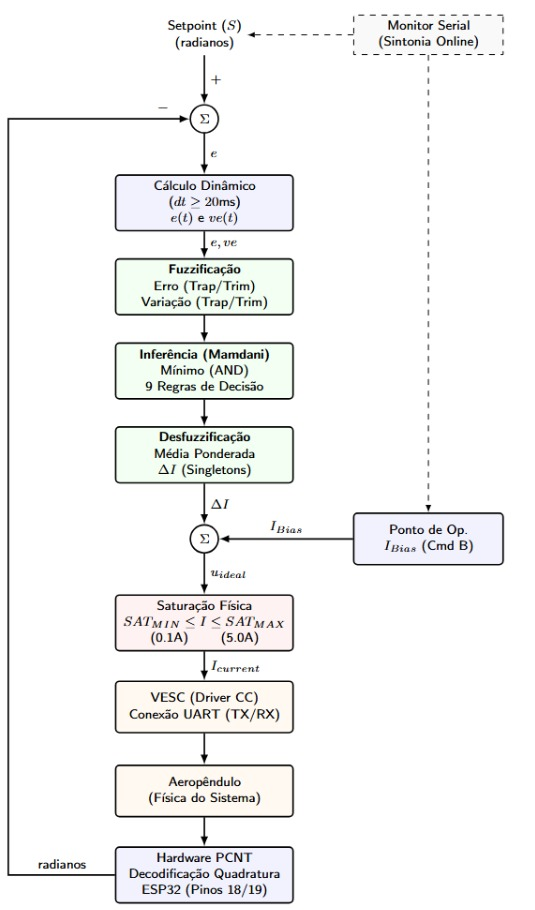

# Controle de Posição de um Aeropêndulo com Lógica Fuzzy

**Projeto Final da disciplina de Controle Inteligente**

**Instituto Federal do Espírito Santo (IFES) – Campus Linhares**

  

## 📖 Sobre o Projeto

Este projeto apresenta o desenvolvimento de um sistema de controle de posição angular para um aeropêndulo utilizando Lógica Fuzzy do tipo Mamdani.

O aeropêndulo consiste em uma haste articulada acionada por um conjunto motor-hélice, caracterizado por uma dinâmica não linear e naturalmente instável. O objetivo do controlador é estabilizar a posição angular da haste e rejeitar perturbações externas, mantendo o sistema próximo ao ponto de operação desejado.

---

## 🔧 Hardware Utilizado

* ESP32
* Motor Brushless DC (BLDC)
* VESC (Vedder Electronic Speed Controller)
* Encoder incremental para medição da posição angular
* Bateria LiPo 11,1 V
* Estrutura mecânica composta por peças impressas em 3D e perfis metálicos

---

## 🧠 Estratégia de Controle

O sistema utiliza um controlador Fuzzy Mamdani com duas variáveis de entrada:

* Erro angular
* Velocidade do erro

A saída do controlador corresponde a uma correção de corrente aplicada ao motor. Além disso, foi implementada uma corrente de equilíbrio (*bias current*), responsável por manter o aeropêndulo próximo ao ponto de operação, enquanto o controlador Fuzzy realiza a compensação de perturbações e corrige desvios de posição.

A sintonia das funções de pertinência, dos singletons e da base de regras foi realizada de forma empírica e experimental, por meio de sucessivos ensaios no protótipo físico. Os parâmetros foram ajustados com base na observação da resposta dinâmica do sistema, buscando um compromisso entre estabilidade, rapidez de resposta e rejeição de perturbações.

  

  <em>Diagrama de blocos da malha fechada do controlador Fuzzy implementado no aeropêndulo.</em>

---

## ⚙️ Principais Características

* Controle em malha fechada com realimentação por encoder;
* Implementação embarcada em ESP32;
* Comunicação com o VESC via UART;
* Controlador Fuzzy Mamdani baseado em regras heurísticas;
* Compensação de perturbações através de corrente de equilíbrio e ação Fuzzy;
* Aplicação em um sistema não linear e instável.

---

## 🎯 Objetivos do Projeto

* Desenvolver uma plataforma experimental para estudos de controle inteligente;
* Aplicar técnicas de Lógica Fuzzy em sistemas dinâmicos reais;
* Avaliar o desempenho de estratégias de controle em um aeropêndulo;

---

## 👨‍💻 Tecnologias Utilizadas

* ESP32
* Arduino Framework
* Lógica Fuzzy Mamdani
* VESC UART
* Impressão 3D
* Controle Embarcado

---

  

## 📚 Contexto Acadêmico

Este trabalho foi desenvolvido como projeto final da disciplina de **Controle Inteligente** do curso de Engenharia de Controle e Automação do **Instituto Federal do Espírito Santo (IFES) – Campus Linhares**, servindo como plataforma de estudos em Sistemas Embarcados, Controle Inteligente e Lógica Fuzzy aplicada ao controle de sistemas dinâmicos.
